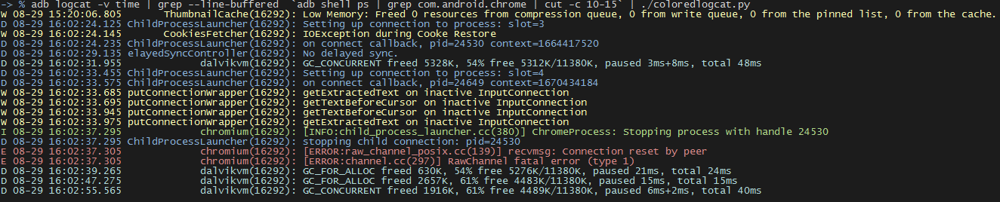

Colored Logcat
==============

A python script which outputs logcat messages in color.

This script was originally written by [Jeff Sharkey](http://jsharkey.org/blog/) and can be found [here](http://jsharkey.org/downloads/coloredlogcat.pytxt).

I changed the code substantially in order to support multiple logcat output formats. The color codes roughly correspond
to the usual output (warning = yellow, error = red, ...) now.



Usage
=====

Put `coloredlogcat.py` in your $PATH.

`coloredlogcat.py` behaves like plain `adb logcat`:

```
$> coloredlogcat.py

$> coloredlogcat.py -v time
```

Or reads from stdin:

```
$> cat logfile.log | coloredlogcat.py

$> adb logcat -v time | grep --line-buffered  `adb shell ps | grep com.android.chrome | cut -c 10-15` | coloredlogcat.py
```

If you restart your app often, you may want to consider putting `endless.sh` in your $PATH. This script is a wrapper around `coloredlogcat.py` and expects the app's package name as argument:

```
$> endless.sh com.android.chrome
```

Press `CTRL+C` to restart reading. This allows you to easily follow the app when it was assigned a new pid.

`endless.sh` briefly echos its own pid before runnig logcat which allows you to stop the script with `kill`.
